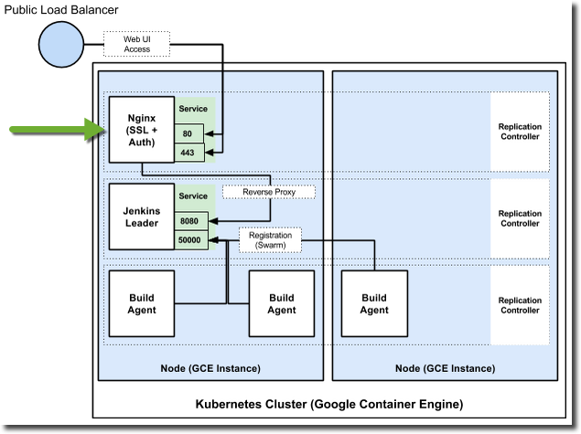

#nginx-ssl-proxy
This repository is used to build a Docker image that acts as an HTTP [reverse proxy](http://en.wikipedia.org/wiki/Reverse_proxy) with optional (but strongly encouraged) support for acting as an [SSL termination proxy](http://en.wikipedia.org/wiki/SSL_termination_proxy). The proxy can also be configured to enforce [HTTP basic access authentication](http://en.wikipedia.org/wiki/Basic_access_authentication). Nginx is the HTTP server, and its SSL configuration is included (and may be modified to suit your needs) at `nginx/proxy_ssl.conf` in this repository.

## Building the Image
Build the image yourself by cloning this repository then running:

```shell
docker build -t nginx-ssl-proxy .
```

## Using with Kubernetes
This image is optimized for use in a Kubernetes cluster to provide SSL termination for other services in the cluster. It should be deployed as a [Kubernetes replication controller](https://github.com/GoogleCloudPlatform/kubernetes/blob/master/docs/replication-controller.md) with a [service and public load balancer](https://github.com/GoogleCloudPlatform/kubernetes/blob/master/docs/services.md) in front of it. SSL certificates, keys, and other secrets are managed via the [Kubernetes Secrets API](https://github.com/GoogleCloudPlatform/kubernetes/blob/master/docs/design/secrets.md).

Here's how the replication controller and service would function terminating SSL for Jenkins in a Kubernetes cluster:



See [https://github.com/GoogleCloudPlatform/kube-jenkins-imager](https://github.com/GoogleCloudPlatform/kube-jenkins-imager) for a complete tutorial that uses the `nginx-ssl-proxy` in Kubernetes.

## Run an SSL Termination Proxy from the CLI
To run an SSL termination proxy you must have an existing SSL certificate and key. These instructions assume they are stored at /path/to/secrets/ and named `cert.crt` and `key.pem`. You'll need to change those values based on your actual file path and names.

1. **Create a DHE Param**

    The nginx SSL configuration for this image also requires that you generate your own DHE parameter. It's easy and takes just a few minutes to complete:

    ```shell
    openssl dhparam -out /path/to/secrets/dhparam.pem 2048
    ```

2. **Launch a Container**

    Modify the below command to include the actual address or host name you want to proxy to, as well as the correct /path/to/secrets for your certificate, key, and dhparam:

    ```shell
    docker run \
      -e ENABLE_SSL=true \
      -e TARGET_SERVICE=THE_ADDRESS_OR_HOST_YOU_ARE_PROXYING_TO \
      -v /path/to/secrets/cert.crt:/etc/secrets/proxycert \
      -v /path/to/secrets/key.pem:/etc/secrets/proxykey \
      -v /path/to/secrets/dhparam.pem:/etc/secrets/dhparam \
      nginx-ssl-proxy
    ```
    The really important thing here is that you map in your cert to `/etc/secrets/proxycert`, your key to `/etc/secrets/proxykey`, and your dhparam to `/etc/secrets/dhparam` as shown in the command above. 

3. **Enable Basic Access Authentication**

    Create an htpaddwd file:

    ```shell
    htpasswd -nb YOUR_USERNAME SUPER_SECRET_PASSWORD > /path/to/secrets/htpasswd
    ```

    Launch the container, enabling the feature and mapping in the htpasswd file:

    ```shell
    docker run \
      -e ENABLE_SSL=true \
      -e ENABLE_BASIC_AUTH=true \
      -e TARGET_SERVICE=THE_ADDRESS_OR_HOST_YOU_ARE_PROXYING_TO \
      -v /path/to/secrets/cert.crt:/etc/secrets/proxycert \
      -v /path/to/secrets/key.pem:/etc/secrets/proxykey \
      -v /path/to/secrets/dhparam.pem:/etc/secrets/dhparam \
      -v /path/to/secrets/htpasswd:/etc/secrets/htpasswd \
      nginx-ssl-proxy
    ```
4. **Add additional nginx config**

   All *.conf from [nginx/extra](nginx/extra) are added during *built* to **/etc/nginx/extra-conf.d** and get included on startup of the container. Using volumes you can overwrite them on *start* of the container:

    ```shell
    docker run \
      -e ENABLE_SSL=true \
      -e TARGET_SERVICE=THE_ADDRESS_OR_HOST_YOU_ARE_PROXYING_TO \
      -v /path/to/secrets/cert.crt:/etc/secrets/proxycert \
      -v /path/to/secrets/key.pem:/etc/secrets/proxykey \
      -v /path/to/secrets/dhparam.pem:/etc/secrets/dhparam \
      -v /path/to/additional-nginx.conf:/etc/nginx/extra-conf.d/additional_proxy.conf \
      nginx-ssl-proxy
    ```

   That way it is possible to setup additional proxies or modifying the nginx configuration.